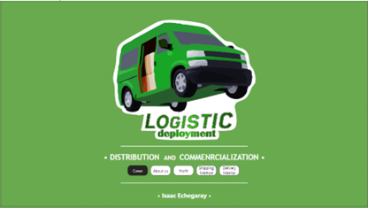
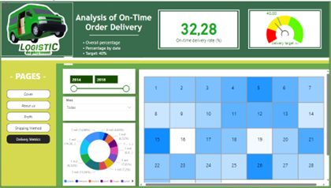
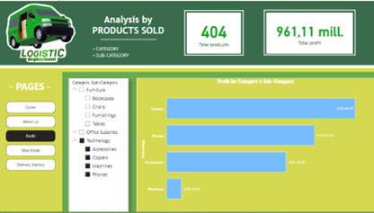
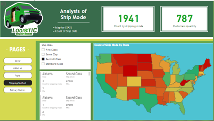

# 📊 Sales Dashboard - Power BI

This project presents an **interactive sales dashboard** developed in **Power BI** for analyzing sales by **region** and **distribution channel**.

---

## 📁 Files Included
- **Sales_Dashboard.pbix** → Power BI source file.
- **sales_dashboard_screenshot.png** → Dashboard preview image.

---

## 🛠 Features
- Filter by **region**, **product category**, and **time period**.
- Automatic calculation of **KPIs**: total sales, profit margin, units sold.
- Trend charts for monthly sales.
- Geographic maps comparing sales performance by region.

---

## 📷 Dashboard Gallery

  
*Main dashboard view - Click to enlarge*

  
*Key logistics KPIs - Click for details*

  
*Gross margin by region*

  
*Transportation distribution*

---

## 📊 Dataset Description
The dataset contains simulated sales transactions with the following columns:
- `OrderDate` – Date of the transaction.
- `Region` – Sales region.
- `Category` – Product category.
- `Sales` – Sales amount in USD.
- `Profit` – Profit amount in USD.

---

## 🚀 Tools & Technologies
- **Power BI Desktop** for dashboard design and analysis.
- **Excel** for dataset preparation.
- **DAX** for calculated measures.

---

[🔙 Back to Main Portfolio](../../README.md)
